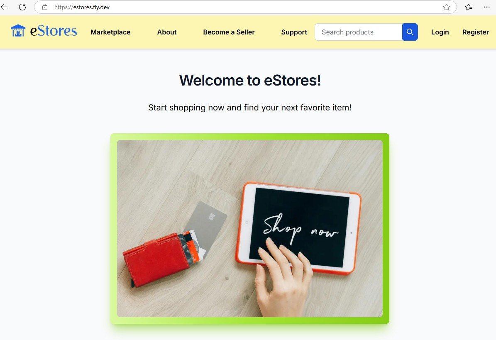
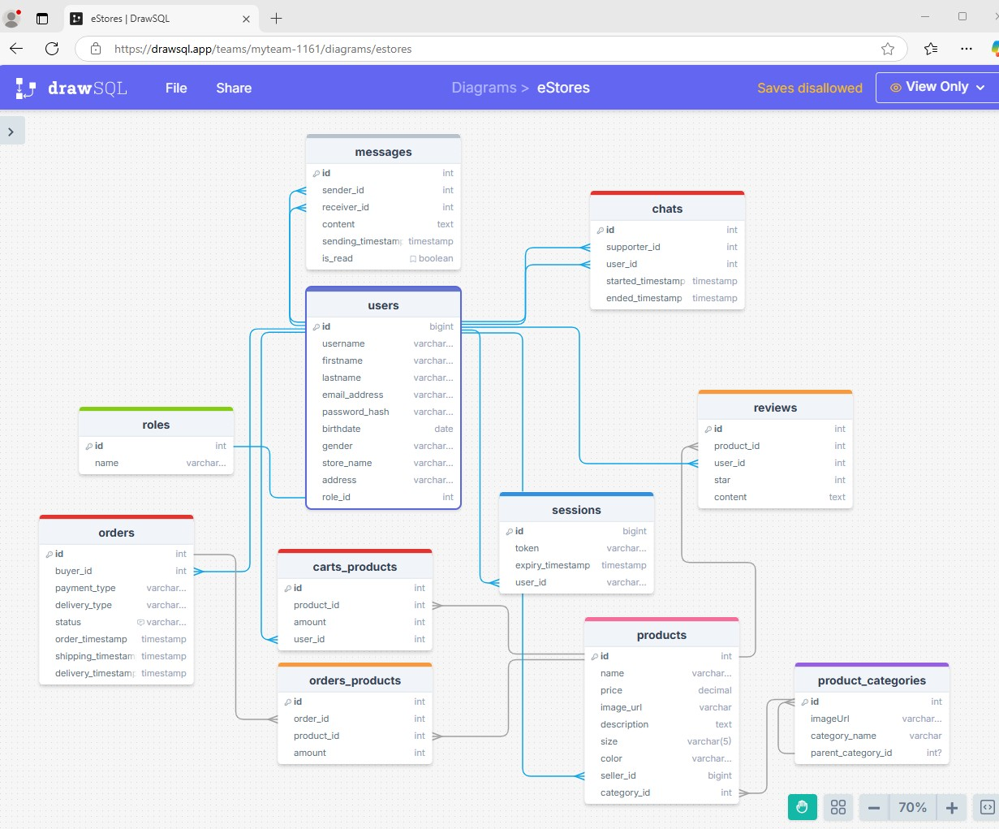

# Next.js E-Commerce Marketplace

Marketplace eStores is an ongoing full-stack web application built with Next.js, continuously evolving and improving.

- A marketplace for buying and selling products.
- Includes user registration, authentication/authorization, product listings, category management, product search, shopping cart, checkout, payment gateway, and separate buyer/seller dashboards.
- Utilizes a database to manage user, product, category, session, cart, and order data, including user-generated content.
- Implements a REST API for seamless frontend-backend communication.
- Server-side data validation using Zod to ensure input integrity.
- Integrates Cloudinary for image processing and hosting.
- Frontend and backend validations for security and data consistency.

### [The marketplace eStores](https://estores.fly.dev/)



### [Category listings](https://estores.fly.dev/marketplace)


### [Database diagram](https://drawsql.app/teams/myteam-1161/diagrams/estores)



## Technologies

- Next.js
- React
- Typescript
- Node.js
- PostgreSQL
- REST API
- Zod authentication
- Cookies
- Tailwind CSS & Flowbite UI
- Cloudinary
- Stripe

## Project Setup

> **Hint:** This project was built with **Node v20.17.0** and **Next.js 15.0.0-canary.171**.  
> Using different versions may cause compatibility issues.

```bash
git clone https://github.com/anntnt/nextjs_finalproject_marketplace.git
cd nextjs_finalproject_marketplace
pnpm install
```

```bash
! Corepack is about to download https://registry.npmjs.org/pnpm/-/pnpm-9.11.0.tgz
? Do you want to continue? [Y/n] Y
```

### Database Setup

If you don't have PostgreSQL installed yet, follow the instructions from the PostgreSQL step in [UpLeveled's System Setup Instructions](https://github.com/upleveled/system-setup/blob/master/readme.md).

Copy the .env.example file to a new .env file (ignored by Git) and update it with your database information, replacing 'xxxxxx' with your own details:

```bash
PGHOST=localhost
PGDATABASE=xxxxxx
PGUSERNAME=xxxxxx
PGPASSWORD=xxxxxx
```

Next, connect to the built-in postgres database as an administrator to create the database:

#### Windows

If it asks for a password, use `postgres`.

```bash
psql -U postgres
```

#### macOS

```bash
psql postgres
```

#### Linux

```bash
sudo -u postgres psql
```

After connecting, run the following command to create the local database using the information from the .env file:

```sql
CREATE DATABASE <database name>;
CREATE USER <user name> WITH ENCRYPTED PASSWORD '<user password>';
GRANT ALL PRIVILEGES ON DATABASE <database name> TO <user name>;
\connect <database name>
CREATE SCHEMA <schema name> AUTHORIZATION <user name>;
```

Quit `psql` using the following command:

```bash
\q
```

On Linux, it is [best practice to create an operating system user for each database](https://docs.redhat.com/en/documentation/red_hat_enterprise_linux/9/html/configuring_and_using_database_servers/using-postgresql_configuring-and-using-database-servers#con_postgresql-users_using-postgresql), to ensure that the operating system user can only access the single database and no other system resources. A different password is needed on Linux because [passwords of operating system users cannot contain the user name](https://github.com/upleveled/system-setup/issues/74). First, generate a random password and copy it:

```bash
openssl rand -hex 16
```

Then create the user, using the database user name from the previous section above. When you are prompted to create a password for the user, paste in the generated password.

```bash
sudo adduser <user name>
```

Once you're ready to use the new user, reconnect using the following command.

**Windows and macOS:**

```bash
psql -U <user name> <database name>
```

**Linux:**

```bash
sudo -u <user name> psql -U <user name> <database name>
```

### PostgreSQL Migrations with Ley

```bash
# Apply all migrations
pnpm migrate up
```

### Run the project locally

```bash
pnpm run dev
```

## Deployment

- Fly.io
- Docker

## Troubleshooting
